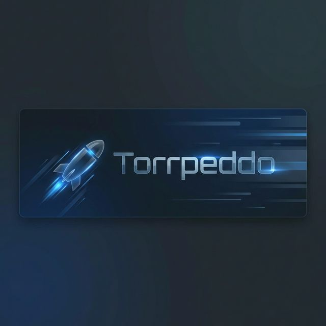
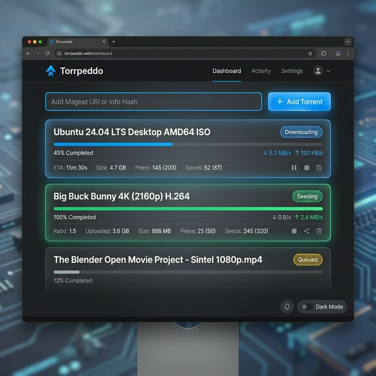

# Torrpeddo



An experimental, single-user torrent client built with Python and Electron.



## Features

- **Magnet Link Support**: Easily add downloads via magnet URIs.
- **.torrent File Upload**: Support for traditional torrent files.
- **Real-time Monitoring**: Live status updates for download/upload speeds, progress, and peers.
- **Customizable Destination**: Set your download folder directly from the app.
- **Premium UI**: Modern dark-mode interface with glassmorphism and smooth animations.

## Installation

1. **Clone the repository**:
   ```bash
   git clone https://github.com/elibaba/Torrpeddo.git
   cd Torrpeddo
   ```

2. **Install dependencies**:
   ```bash
   pip install -r requirements.txt
   npm install
   ```
   *Note: On Linux, you might need to install `libtorrent` system-wide:*
   `sudo apt-get install python3-libtorrent`

3. **Run the application**:
   ```bash
   npm start
   ```

## Tech Stack

- **Wrapper**: Electron
- **Backend**: Python (via IPC bridge)
- **Torrent Engine**: libtorrent
- **Frontend**: Vanilla HTML/CSS/JS (Renderer process)

## Project Structure

```text
Torrpeddo/
├── main.js             # Electron main process
├── preload.js          # Electron preload script
├── backend/
│   ├── bridge.py       # IPC bridge between Electron and Manager
│   └── manager.py      # Core torrent logic (Python)
├── renderer/           # Frontend assets (HTML/CSS/JS)
│   ├── index.html
│   └── static/
└── package.json        # Node.js configuration
```
