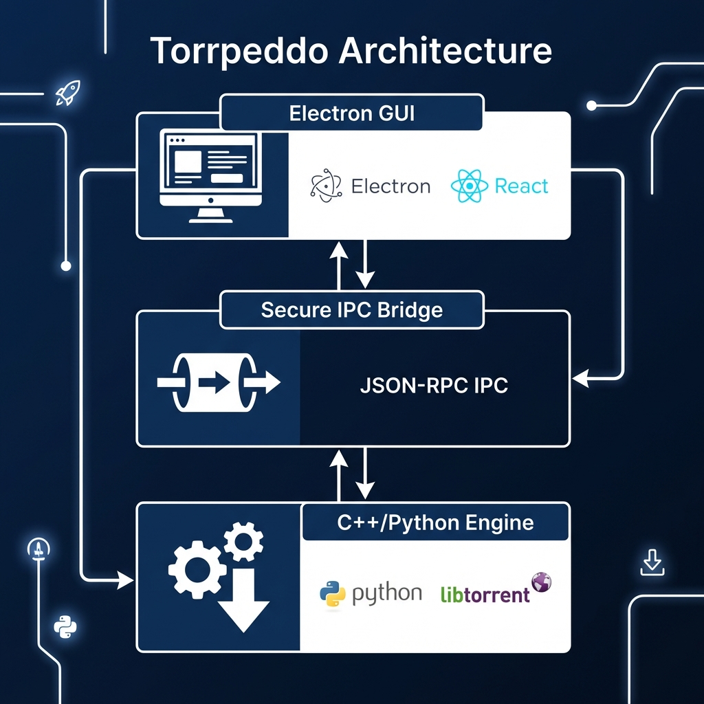

# Torrpeddo Project Book

## Executive Summary
Torrpeddo is an industrial-grade, premium torrent client designed for the modern desktop. By combining the speed of the C++ `libtorrent` engine with the versatility of the Electron framework, Torrpeddo offers a seamless, high-performance experience that bridges the gap between complex network protocols and professional user interfaces.

---

## Architectural Deep Dive

Torrpeddo follows a decoupled architectural pattern, separating the presentation layer from the core logic and network engine. This is achieved through three primary layers:

### 1. Frontend: Electron Framework
**What is Electron?**
Electron is an open-source framework developed by GitHub that allows developers to build cross-platform desktop applications using web technologies: HTML, CSS, and JavaScript. It combines the Chromium rendering engine (for the UI) and the Node.js runtime (for system-level access).

**Benefits for Torrpeddo:**
- **Visual Excellence**: Leveraging the full power of modern CSS and web components to create a "WOW" factor UI that feels premium.
- **Cross-Platform Compatibility**: A single codebase provides a consistent experience across Linux, Windows, and macOS.
- **Native Experience**: Provides access to native OS features like file dialogs, tray notifications, and filesystem integration.

### 2. The Bridge: IPC (Inter-Process Communication)
**What is IPC?**
IPC, or Inter-Process Communication, is a mechanism that allows different processes to share data and coordinate actions. In Torrpeddo, we use a custom IPC bridge to connect the Electron frontend with the Python backend.

**Implementation: Secure JSON-RPC**
Communication is handled via a **JSON-RPC** protocol over **stdin/stdout** channels. 
- The Electron process spawns a dedicated Python child process.
- Commands (e.g., `add_magnet`, `get_status`) are serialized into JSON strings and sent to the Python process.
- The Python process executes the logic and returns a structured JSON response.

**Why this approach?**
- **Decoupling**: The engine can be updated, debugged, or even replaced without touching the UI.
- **Security**: The backend runs as a separate process, providing a layer of isolation.
- **Performance**: High-speed communication with minimal overhead compared to HTTP-based local servers.

### 3. Backend Engine: Python & libtorrent
**The Core: libtorrent**
At the heart of Torrpeddo is `libtorrent`, a feature-complete C++ BitTorrent implementation. It is widely considered one of the most efficient and robust engines in existence.

**Multi-threaded Performance:**
- **Engine Level**: `libtorrent` 2.0+ utilizes an internal thread pool for disk I/O, network polling, and piece validation. This allows for parallel processing of multiple torrent fragments simultaneously.
- **Manager Level**: The Python `TorrentManager` utilizes daemon threads to handle non-blocking torrent additions, ensuring that the IPC bridge never stalls while metadata is being fetched.

---

## Development Process & Methodology
The Torrpeddo project followed a "Platform-First" methodology:
1. **Engine Validation**: Rigorous testing of `libtorrent` benchmarks to ensure maximum throughput.
2. **Bridge Optimization**: Implementation of non-blocking I/O in the IPC bridge to prevent UI "micro-stutters".
3. **Packaging**: Integration of `electron-builder` and `PyInstaller` to create unified, single-binary distributors for end-users.

---
(c) 2026 Torrpeddo Team. All rights reserved.
